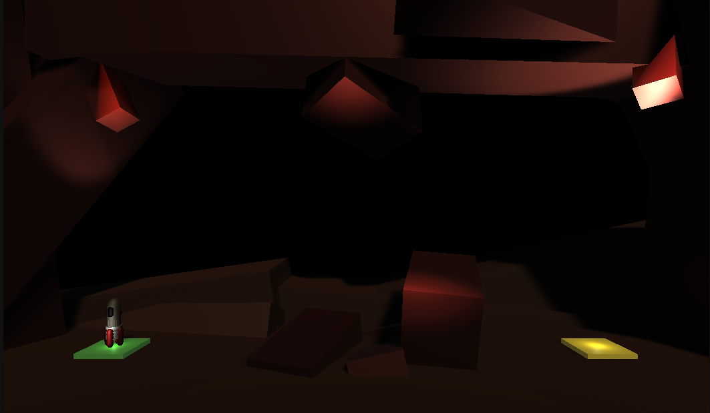

# unity-rocket-game-2023

A small rocket game made with Unity

This project is a result of my participation in the **Complete C# Unity Game Developer 3D course**, instructed by Ben Tristem. Through this engaging course, I gained a solid understanding of creating 3D games with static scenes. Utilizing C# scripts, I honed my ability to manipulate game objects and craft enjoyable game designs. Moreover, the learning journey encompassed various concepts, including rigidBody, collision handling, scene management, oscillation motion using sine function, particle effects, and audio clips. There are some features such as UI no implemented, which I hope I am able to learn in the future.

## How to play

The goal of the game is to reach the landing pad (yellow) by maneuvering through the obstacles.

## Controls

W or Space - boost upwards  
A or Left Arrow - rotate left  
D or Right Arrow - rotate right

## Features

- 4 total different levels
- particle effects
- sound effects
- oscillating obstacles

## Limitations

- No UI implemented
- Level loops back after last level
